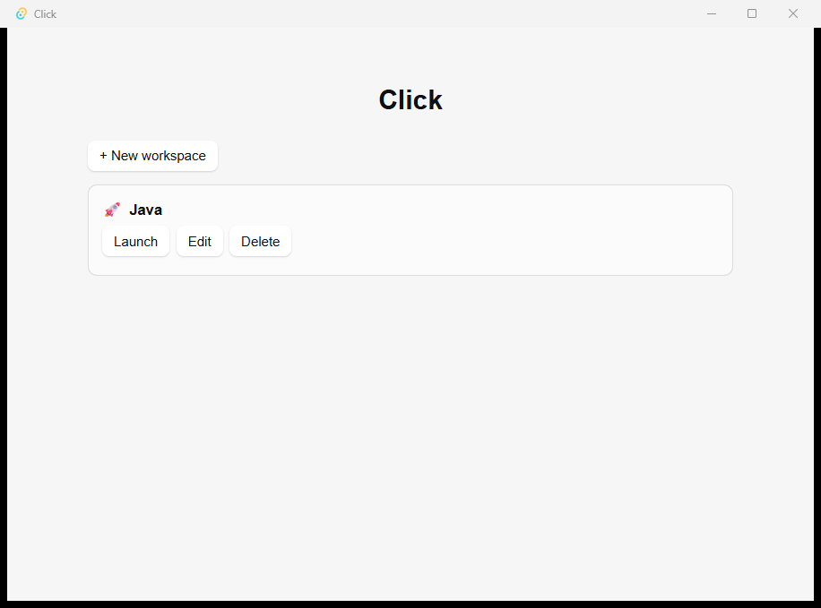

<div align="center">

# Click

**Boot your entire development environment in one click.**

Define a *workspace* — a bundle of apps, URLs, and settings — and launch the whole thing with one button, one global hotkey, one desktop shortcut, or one CLI command.

[](LICENSE)
[](https://tauri.app)
[](#installation)




</div>

---

## Why

Starting a dev session means opening the same pile of tools every single time: an IDE at the right folder, a database client, Docker, a terminal for the dev server, and a fistful of browser tabs (localhost, the repo, the ticket board, docs). It's repetitive, slow, and has to be redone per project.

**Click** captures "everything I need for *this* project" as a reusable **workspace** and boots all of it in one action. It lives in your system tray and stays out of the way.

## Features

- **Workspaces** — create, edit, duplicate, and delete named bundles of actions.
- **App actions** — launch any executable with command-line arguments and a working directory. Handles `.cmd`/`.bat` shims (like `code`) correctly, and launches without a console flash.
- **URL actions** — open links in your system default browser.
- **Sequential launch** with a configurable delay between actions (global default + per-action override).
- **Variables** — `${PROJECT_DIR}`, `${HOME}`, etc., resolved at launch time so the same config works across machines. Falls back to process environment variables.
- **Per-action enable/disable and labels** — toggle an action off without deleting it.
- **Live launch progress** — see which actions started, were skipped, or failed, with specific error messages. One failing action never aborts the rest.
- **The "one click", four ways:**
  - **System tray** menu — quick-launch any workspace without opening the main window.
  - **Global hotkeys** — assign a shortcut like `Ctrl+Alt+1` per workspace.
  - **Desktop shortcuts** — generate a real `.lnk` that launches a workspace on double-click, even when the app isn't already open.
  - **CLI** — `click run --id <uuid>` for scripting and Start-menu use.
- **Single instance** — a second launch forwards its command to the running app instead of starting a duplicate.
- **Local, human-readable config** — one JSON file you can read, diff, and back up.
- **Validation** — a missing executable path or malformed URL is flagged in the editor before you ever launch.

## Installation

### Download

1. Grab the latest `click_x.y.z_x64-setup.exe` (NSIS) or `.msi` from the [Releases](../../releases) page.
2. Run it.

> **Heads up — unsigned build.** Click isn't code-signed yet, so Windows SmartScreen will show a warning on first run. Click **More info → Run anyway**. (See [SECURITY.md](SECURITY.md).)

### Build from source

See [Development](#development).

## Usage

1. **Create a workspace** — click **+ New workspace**, give it a name.
2. **Add actions** — **+ Add app** (browse to an `.exe`, add args like `${PROJECT_DIR}`) or **+ Add URL**.
3. **Launch** — hit **Launch**. Watch the per-action progress.
4. **Make it one-click** — from the editor, **Create desktop shortcut**, or assign a **global hotkey**, or use the **tray** menu.
5. **From the terminal** — `click run --id <workspace-uuid>`.

Closing the window hides Click to the tray; use **Quit** from the tray menu to exit fully.

## Configuration

Workspaces live in a single human-readable JSON file:

```
%APPDATA%\com.launchpad.app\workspaces.json
```

Example:

```jsonc
{
  "version": 1,
  "workspaces": [
    {
      "id": "b3f1c2d4-…",
      "name": "Project X — Backend",
      "description": "Spring Boot API + Postgres + frontend",
      "variables": { "PROJECT_DIR": "C:/dev/project-x" },
      "launchStrategy": "sequential",
      "defaultDelayMs": 300,
      "hotkey": "Ctrl+Alt+1",
      "actions": [
        {
          "type": "app",
          "label": "IntelliJ IDEA",
          "path": "C:/Program Files/JetBrains/IDEA/bin/idea64.exe",
          "args": ["${PROJECT_DIR}"],
          "cwd": "${PROJECT_DIR}",
          "enabled": true,
          "delayAfterMs": 1000
        },
        { "type": "url", "label": "Repo", "url": "https://github.com/me/project-x", "enabled": true }
      ]
    }
  ]
}
```

Field names are **camelCase**. Variables use `${NAME}` and resolve against the workspace `variables` map first, then process environment variables.

## Development

### Prerequisites

| Tool | Notes |
|---|---|
| **Rust** | Install via [rustup](https://rustup.rs) with the **MSVC** toolchain (`stable-x86_64-pc-windows-msvc`). |
| **Visual Studio Build Tools 2022** | The **Desktop development with C++** workload — Tauri links against MSVC. |
| **Node.js** | 18+ (developed on 25). |
| **WebView2** | Ships with Windows 11; no action needed. |

### Run

```bash
npm install
npm run tauri dev      # hot-reloading dev build, opens the window
```

### Build installers

```bash
npm run tauri build    # produces the NSIS .exe and .msi under src-tauri/target/release/bundle/
```

### Test

```bash
cd src-tauri && cargo test    # Rust unit tests
npm run build                 # tsc + vite production build
npx tsc --noEmit              # type-check only
```

## Project structure

The single most important design decision: **the launch engine lives in Rust, not the webview.** A desktop shortcut or `click run …` must be able to boot a workspace *without* spinning up a WebView2 window, so all launching, config, tray, hotkeys, and shortcut logic is native. The React UI is a pure editor that calls Rust commands and never spawns anything itself.

**Rust core** (`src-tauri/src/`):

| Module | Responsibility |
|---|---|
| `lib.rs` | App builder, plugin registration, tray/hotkey/CLI wiring, window-close-to-tray. |
| `model.rs` | `Workspace` / `Action` data model (serde). |
| `store.rs` | Load/save `workspaces.json` with atomic writes and a versioned migration hook. |
| `vars.rs` | `${VAR}` resolution (workspace map → process env). |
| `launch.rs` | The launch engine: sequential execution, delays, `.cmd`/`.bat` handling, per-action outcomes. |
| `commands.rs` | The `#[tauri::command]` surface (CRUD, validate, launch, shortcut). |
| `tray.rs` | System-tray icon and menu (rebuilt on every config change). |
| `hotkeys.rs` | Per-workspace global-shortcut registration. |
| `cli.rs` | `run --id` handling, shared by first-launch and single-instance forwarding. |
| `shortcut.rs` | Windows `.lnk` generation (OneDrive-aware Desktop resolution). |

**React UI** (`src/`):

| File | Responsibility |
|---|---|
| `App.tsx` | Top-level view switch (list ↔ editor). |
| `components/WorkspaceList.tsx` | Home screen — list + launch/edit/delete. |
| `components/WorkspaceEditor.tsx` | Workspace editor — actions, variables, hotkey, shortcut. |
| `components/ActionEditor.tsx` | Per-action editor (app/URL fields, validation). |
| `components/LaunchProgress.tsx` | Live per-action launch status. |
| `api.ts` / `types.ts` | Typed wrappers around Tauri `invoke`; TS types that mirror the Rust model. |

**Stack:** [Tauri v2](https://tauri.app) · Rust · React 19 · TypeScript · Vite.

## Roadmap

**Shipped (v0.1.0):** workspace CRUD · app + URL actions · sequential launch with variables and delays · system tray · global hotkeys · CLI · single-instance · desktop-shortcut generation · Windows installer.

**Planned / deferred:** command & script actions · readiness gates (port/HTTP/process) · parallel launch · skip-if-running · import/export with path remapping · dry-run preview · browser & profile selection · launch history · teardown ("close workspace") · macOS/Linux · code signing & auto-update.

See [docs/REQUIREMENTS.md](docs/REQUIREMENTS.md) for the full design specification.

## Contributing

Contributions are welcome — see [CONTRIBUTING.md](CONTRIBUTING.md). Please also read the [Code of Conduct](CODE_OF_CONDUCT.md).

## Security

Click launches processes and (in future) runs commands, so configs are executable content. Please review [SECURITY.md](SECURITY.md) for the security model and how to report a vulnerability.

## License

[MIT](LICENSE) © 2026 Prashant Singh
